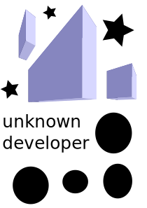

***

# Merge Plane

# By:

### Top

# `README.md`

***

# Index

[00.0 - Top](#Top)

[01.0 - Index](#Index)

[02.0 - Description](#SeansLifeArchive_Images_Merge-planes)

[03.0 - About](#About)

[04.0 - Wiki](#Wiki)

[05.0 - Version history](#Version-history)

[06.0 - Contributers](#Contributers)

[07.0 - Issues](#Issues)

> [07.1 - Current issues](#Current-issues)

> [07.2 - Past issues](#Past-issues)

> [07.3 - Past pull requests](#Past-pull-requests)

> [07.4 - Active pull requests](#Active-pull-requests)

[08.0 - Resources](#Resources)

[09.0 - Contributing](#Contributing)

[10.0 - About README](#About-README)

[11.0 - README Version history](#README-version-history)

[12.0 - Footer](#You-have-reached-the-end-of-the-README-file)

***

# SeansLifeArchive_Images_Merge-planes
The module for my life story project that contains my Merge Plane gameplay images.

***

## About

See above. This repository hosts all mt daily/weekly Merge Plane session pictures. I currently play the [Android version (404)](https://play.google.com/store/apps/details?id=404) I never played the iOS version, as I started playing this game later than 2015 (starting in 2018)

These daily pictures are to be used for progress monitoring, but can also be used as stock images. You can learn more about Merge Plane by [clicking/tapping here (the game doesn't have a Wikipedia page)](https://www.crazygames.com/game/merge-plane). You can download an APK through APKPure if you are fine with dealing with hCaptcha [APKPure link](https://apkpure.com/merge-plane-click-idle-tycoon/com.brokenreality.planemerger.android)

***

## Wiki

[Click/tap here to view this projects Wiki](https://github.com/seanpm2001/SeansLifeArchive_Images_Merge-planes/wiki)

***

## Version history

Unavailable

[More versions coming soon](https://www.example.com)

***

## Contributers

Currently, I am the only contributer. Contributing is not allowed, as this is a personal project.

> * 1. [seanpm2001](https://github.com/seanpm2001/) - 85 commits (As of Friday, November 13th 2020 at 11:40 am)

> * 2. No other contributers.

***

## Issues

### Current issues

None at the moment.

### Past issues

None at the moment.

### Past pull requests

None at the moment.

### Active pull requests

None at the moment

***

## Resources

Here are some other resources for this project:

[Project language file](LANG.pas)

[Merge Plane on the app store (no longer exists)](https://apps.apple.com)

[Download an APK of Merge Plane using APKPure](https://apkpure.com/merge-plane-click-idle-tycoon/com.brokenreality.planemerger.android)

### Images

[Merge_Plane_Logo.png (PNG)](Merge_Plane_Logo.png)

[UnknownDeveloper.svg (SVG)](UnknownDeveloper.svg)

No other resources at the moment.

***

## Contributing

Contributing is not allowed for this project, as it is a personal project.

[Click/tap here to view the contributing rules for this project](CONTRIBUTING.md)

***

## About README

File type: `Markdown (*.md)`

File version: `2 (Friday, November 13th 2020 at 11:40 am)`

Line count: `0,230`

***

## README version history

Version 1 (Friday, November 6th 2020 at 7:51 pm)

> Changes:

> * Started the file

> * Added the title section

> * Added the index

> * Added the about section

> * Added the Wiki section

> * Added the version history section

> * Added the issues section.

> * Added the past issues section

> * Added the past pull requests section

> * Added the active pull requests section

> * Added the contributors section

> * Added the contributing section

> * Added the about README section

> * Added the README version history section

> * No other changes in version 1

Version 2 (Friday, November 13th 2020 at 11:40 am)

> Changes:

> * Updated the about section

> * Added the resources section

> * Added release notes for v2

> * Added template entries for v3 and v4

> * Updated the file info section

> * Updated the index

> * Updated the contributers section

> * No other changes in version 2

Version 3 (coming soon)

> Changes:

> * Coming soon

> * No other changes in version 3

Version 4 (coming soon)

> Changes:

> * Coming soon

> * No other changes in version 4

***

### You have reached the end of the README file

[Back to top](#Top) [Exit](https://github.com)

***
